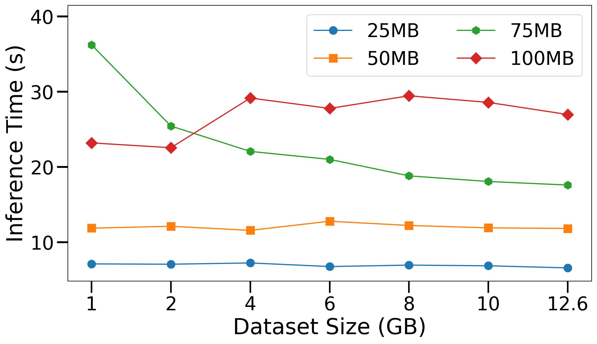
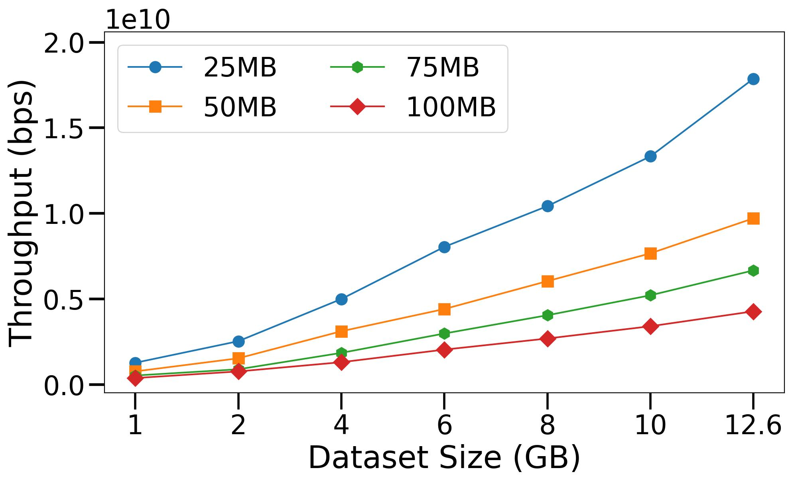

# Cloud-based Astronomy Inference (CAI)

This proposes a novel **Cloud-based Astronomy Inference (CAI)** framework for data parallel AI model inference on AWS. We can classify 500K astronomy images using the AstroMAE model in a minute ! 

#### Fig 1: CAI framework design on AWS State Machine.

A brief description of the workflow:

1. *Initialize*: Based on the input payload ([Sample input](./aws/demo%20input.json)) list the partition files and config for each job. Returns an array. 
2. *Distributed Model Inference*: Runs distributed map of Lambda executions based on the array returned by previous state. Each of these jobs:
   1. Load the code, pretrained AI model in a container. 
   2. Download a partition file as specified in input config. The paritions are created and uploaded to a S3 bucket beforehand.
   3. Run inference on the file and write the execution info to the `result_path`.
3. *Summarize*: Summarize the results returned by each lambda execution in the previous distributed map. Concatenate all of those result.json files into a single combined_data.json.

## Results

### Varying data size

The total data size is 12.6GB. We run the inference for different sizes to evaluate the scaling performance with increasing data load. This experiment runs with size 1GB, 2GB, 4GB, 6GB, 8GB, 10GB and 12.6GB. Batch size 512.

Please check the [result_stats.csv](./aws/results/result_stats.csv) for the average results.

#### Fig 2: Dataset size vs Inference time for each partition

#### Fig 3: Data size vs Throughput for each partition

### Varying batch size

#### Fig 4: Batch size vs Inference Time

#### Fig 5: Batch size vs Throughput

## Cost estimate

This is done using [AWS calculator](https://calculator.aws/#/createCalculator/Lambda). The cost for invoking the AWS Lambda function is $0.00001667 per GB-second of computation time. Our framework calls the Lambda function during initialization, parallel processing, and summarization. The following table shows a summary of some example cases to estimate the computation cost for our task.

Estimated AWS computation cost summary for inference on the total dataset. Cost is *requests x duration(s) x memory(GB) x 0.00001667*.

| Partition | Requests | Duration (s)| Memory | Cost ($) |
|:---:|:---:|:---:|:---:|:---:|
| 25MB | 517 | 6.55 | 2.8GB | 0.16 |
| 50MB | 259 | 11.8 | 4.0GB | 0.20 |
| 75MB | 173 | 17.6 | 5.9GB| 0.30 |
| 100MB | 130 | 25 | 7.0GB | 0.38 |

The number of requests is how many times the Lambda function was called, which is the number of concurrent jobs (data divided by partition size). The maximum memory size can be configured based on memory usage (smaller partitions use less memory). Other costs, for example, request charge ($2e-7/request), and storage charge ($3.09e-8/GB-s if > 512MB) are negligible.

