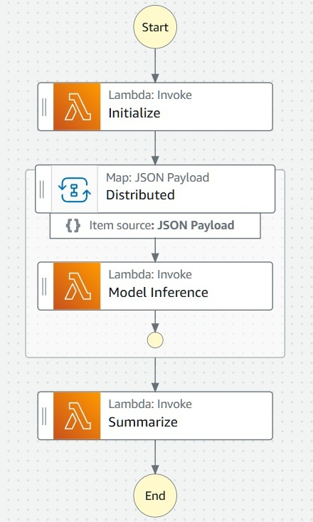
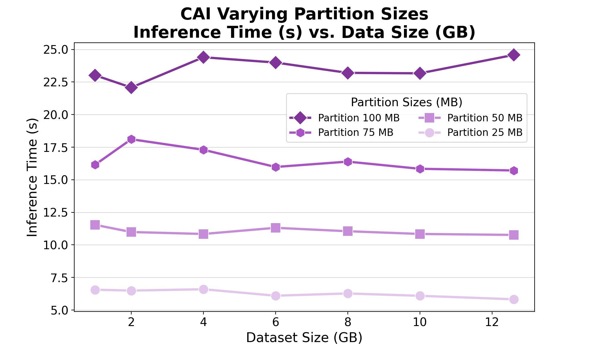
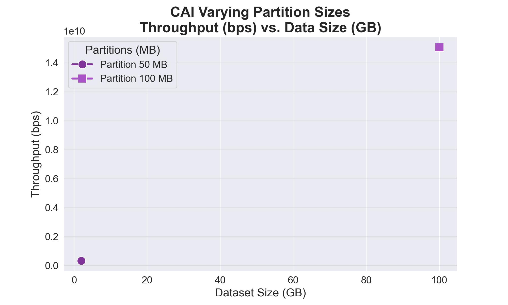
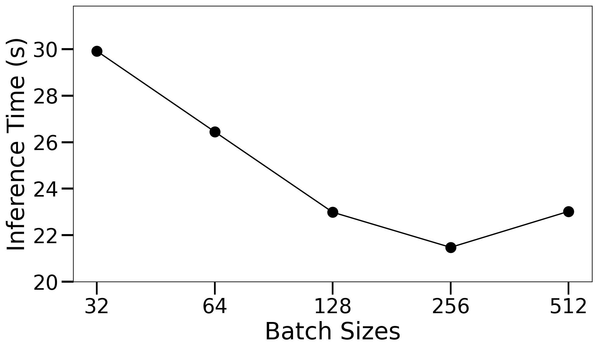
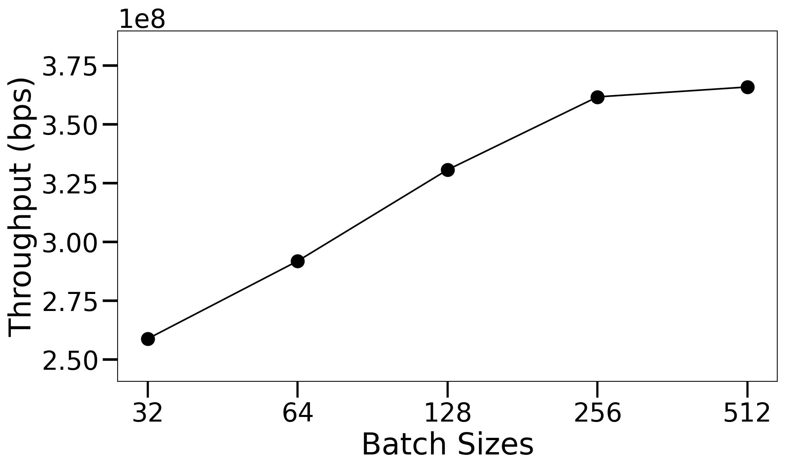

# Cloud-based Astronomy Inference (CAI)

This proposes a novel **Cloud-based Astronomy Inference (CAI)** framework for data parallel AI model inference on AWS. We can classify 500K astronomy images using the AstroMAE model in a minute ! 

<div align="center" style="overflow-x:auto;">

#### Fig 1: CAI framework design on AWS State Machine.


</div>

A brief description of the workflow:

1. *Initialize*: Based on the input payload ([Sample input](./aws/demo%20input.json)) list the partition files and config for each job. Returns an array.
2. *Distributed Model Inference*: Runs distributed map of Lambda executions based on the array returned by previous state. Each of these jobs:
   1. Load the code, pretrained AI model in a container. 
   2. Download a partition file as specified in input config. The paritions are created and uploaded to a S3 bucket beforehand.
   3. Run inference on the file and write the execution info to the `result_path`.
3. *Summarize*: Summarize the results returned by each lambda execution in the previous distributed map. Concatenate all of those result.json files into a single combined_data.json.

## Reproduce

<details>

### Data Processing

The whole data needs to be split into smaller chunks so that we can run parallel executions on them.

1. Get the total dataset fro [Google drive](https://drive.google.com/drive/folders/18vX8-6LcGOmRyTbkJwMDOgQY15nGWves?usp=sharing).
2. Split into smaller chunks (e.g. 10MB) using the [split_data.py](./aws/split_data.py).
3. Now upload those file partitions into a S3 bucket.

### Code

Upload the [Anomaly Detection](./code/Anomaly%20Detection/) folder into a S3 bucket.

### Input Payload

This is passed to the state machine as input. It assumes the code and data are loaded into a S3 bucket named `cosmicai-data`. You can update the lambda functions to change it. The following is a [sample input payload](./aws/demo%20input.json):

```json
{
  "bucket": "cosmicai-data",
  "file_limit": "11",
  "batch_size": 512,
  "object_type": "folder",
  "S3_object_name": "Anomaly Detection",
  "script": "/tmp/Anomaly Detection/Inference/inference.py",
  "result_path": "result-partition-100MB/1GB/1",
  "data_bucket": "cosmicai-data",
  "data_prefix": "100MB"
}
```

This means

* The [Anomaly Detection](./code/Anomaly%20Detection/) folder is uploaded in `cosmicai-data` bucket. 
* The partition files are in `cosmicai-data/100MB` folder (`data_bucket/data_prefix`). 
* Our inference batch size is 512.
* This is running for `1GB` data.
* The results are saved in `bucket/result_path` which is `cosmicai-data/result-partition-100MB/1GB/1` in this case.
* We set the file limit to 11, since 1GB file with 100MB partition size will need ceil(1042MB / 100MB) = 11 files. Using 22 files here will run ro 2GB data. See the [total_execution_time.csv](./aws/results/total_execution_time.csv) for what should be the file_limit for different partitions and data sizes.

If you need to change more

* We run each experiment 3 times. Hence `1GB/1`, `1GB/2` and `1GB/3`.
* To benchmark for different batch sizes (32, 64, 128, 256, 512), when keeping the data size same, I saved them in `Batches` subfolder. For example, `result-partition-100MB/1GB/Batches/`.
* If you are running your own experiments, just ensure you change the `result_path` to a different folder (e.g. `team1/result-partition-100MB/1GB/1` is ok).

### State Machine

Create a state machine that contains the following Lambda functions.

<div align="center" style="overflow-x:auto;">

#### Fig: AWS State Machine.


</div>

1. Initialize: Create a lambda function (e.g. `data-parallel-init`) with the [lambda_initializer](./aws/lambda/lambda_initializer.py). 
   1. Attach necessary permissions to the execution role: `AmazonS3FullAccess`, `AWSLambda_FullAccess`, `AWSLambdaBasicExecutionRole`, `loudWatchActionsEC2Access`.
   2. Create a cloudwatch log group with the same name as `/aws/lambda/data-parallel-init`. Log group helps debugging errors.
   3. This script creates an array of job configs based on the input payload for each file. Then save it as `payload.json` in the `bucket`.
2. Distributed Inference: Create a distributed map using a lambda container that has all required libraries installed. This fetches the `S3_object_name` folder and starts the python file at `script`. The script does the following:
   1. Read the environment variables (rank, world size). Also the `payload.json` from the `bucket`. This part is hard-coded and should be changed if you want to read payload from a different location.
   2. Fetch the file from `data_bucket/data_prefix` folder.
   3. Run inference and benchmark the execution info.
   4. Save the json file in `result_path` location as `rank_no.json`.
3. Summarize: Create a Lambda using [lambda_summarizer.py](./aws/lambda/lambda_summarizer.py). Same role permissions as the Initialize. 
   1. Reads the result json files created in the previous state.
   2. Concatenates all to get `combined_data.json` and saves it at `result_path`.

### Run

<div align="center" style="overflow-x:auto;">

#### Step 1: Go to the AWS State Machine. Click Start execution.


#### Step 2: Copy the input payload. Modify as needed.


#### Step 3: Once succeeds, check the result paths for output.


</div>

### Collect Results

1. I collected the results locally using `aws cli`. After installing and configuring it for the class account running `aws s3 sync s3://cosmicai-data/result-partition-100MB result-partition-100MB` will sync the result file locally.
2. The [stats.py](./aws/stats.py) iterates through each `combined_data.json` file and saves the summary in [batch_varying_results.csv](./aws/results/batch_varying_results.csv) when batch size is changed for 1GB data and [result_stats.csv](./aws/results/result_stats.csv) for varying data sizes.
3. The total execution times were manually added in [total_execution_time.csv](./aws/results/total_execution_time.csv).

</details>

## Results

<details>

### Varying data size

The total data size is 12.6GB. We run the inference for different sizes to evaluate the scaling performance with increasing data load. This experiment runs with size 1GB, 2GB, 4GB, 6GB, 8GB, 10GB and 12.6GB. Batch size 512.

Please check the [result_stats.csv](./aws/results/result_stats.csv) for the average results.

<div align="center" style="overflow-x:auto;">

#### Fig 2: Dataset size vs Inference time for each partition


</div>

<div align="center" style="overflow-x:auto;">

#### Fig 3: Data size vs Throughput for each partition


</div>

### Varying batch size

We use the 1GB data and change batch size by [32, 64, 128, 256, 512]. The results are in [batch_varying_results.csv](./aws/results/batch_varying_results.csv).

<div align="center" style="overflow-x:auto;">

#### Fig 4: Batch size vs Inference Time


</div>

<div align="center" style="overflow-x:auto;">

#### Fig 5: Batch size vs Throughput


</div>

</details>

## Cost estimate

<details>
This is done using [AWS calculator](https://calculator.aws/#/createCalculator/Lambda). The cost for invoking the AWS Lambda function is $0.00001667 per GB-second of computation time. Our framework calls the Lambda function during initialization, parallel processing, and summarization. The following table shows a summary of some example cases to estimate the computation cost for our task.

Estimated AWS computation cost summary for inference on the total dataset. Cost is *requests x duration(s) x memory(GB) x 0.00001667*.

<div align="center" style="overflow-x:auto;">

| Partition | Requests | Duration (s)| Memory | Cost ($) |
|:---:|:---:|:---:|:---:|:---:|
| 25MB | 517 | 6.55 | 2.8GB | 0.16 |
| 50MB | 259 | 11.8 | 4.0GB | 0.20 |
| 75MB | 173 | 17.6 | 5.9GB| 0.30 |
| 100MB | 130 | 25 | 7.0GB | 0.38 |

</div>

The number of requests is how many times the Lambda function was called, which is the number of concurrent jobs (data divided by partition size). The maximum memory size can be configured based on memory usage (smaller partitions use less memory). Other costs, for example, request charge ($2e-7/request), and storage charge ($3.09e-8/GB-s if > 512MB) are negligible.

</details>